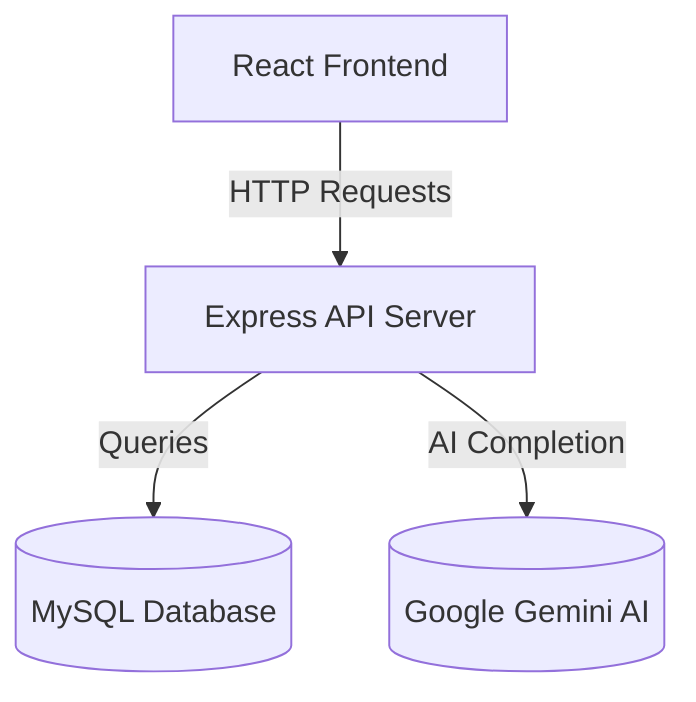

# Architecture Overview

**Analysis Date:** 2026-03-22

## System Architecture

The project follows a **Client-Server Architecture** with a clear separation between the frontend (React) and backend (Node.js/Express) components.

### Diagram

## Application Layers

### Frontend (Client)
- **Library:** React (v18.3.1).
- **Styling:** Vanilla CSS with a focus on modern aesthetics (Glassmorphism, animations).
- **State Management:** React `useState` and `useContext` for session and project data.
- **Routing:** Client-side routing with `react-router-dom`.
- **Key Components:** `Chatbot.jsx`, `Navbar.jsx`, `Dashboard.jsx`, etc.

### Backend (Server)
- **Framework:** Express (v4.19.2).
- **Routing:** Centralized routing in `server/routes.js` (currently contains most logic).
- **Data Persistence:** Using `mysql2` for executing SQL queries against the database.
- **AI Integration:** Integration with Google Gemini for trip planning and chatbot features.
- **Security:** Password hashing with `bcryptjs` and token-based authentication with `jsonwebtoken`.

### Database
- **Schema:** Relational schema including tables for `users`, `destinations`, `transport`, `hotels`, and `user_trips`.
- **Driver:** Using `mysql2`'s `execute` for prepared statement support.

## Data Flow

### AI Trip Planning
1. Client sends destination, duration, and budget to `/api/ai/plan`.
2. Backend generates a structured prompt for Google Gemini.
3. Gemini returns a text-based itinerary.
4. Backend sends the itinerary back to the client for display.

### User Authentication
1. Client sends credentials to `/api/register` or `/api/login`.
2. Backend interacts with the `users` table to create or verify records.
3. On login, a JWT token is generated and returned to the client for subsequent authorized requests.

## Key Design Patterns
- **Fallback Mechanism:** The backend often includes hardcoded mock data for `destinations`, `transport`, and `hotels` as a fallback when database queries fail or records are missing.
- **Glassmorphism UI:** A custom design system implemented in `client/src/index.css` using `backdrop-filter` and semi-transparent backgrounds.

---

*Architecture analysis: 2026-03-22*
*Update after major system design changes*
